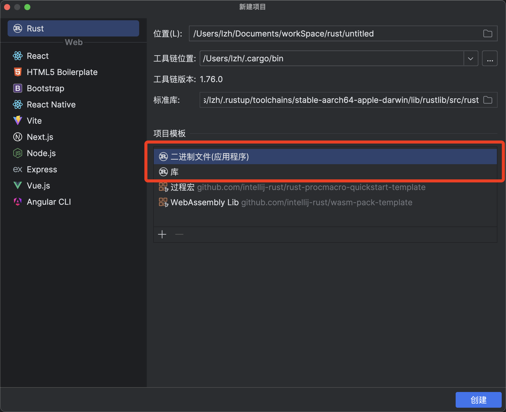

# README

## Rust练手项目：区块链模拟

### 参考：[b站🚪](https://www.bilibili.com/video/BV145411t7qp?p=1&vd_source=2a53234bb2dca674400136ff132da8a0)

## @todo：仿照区块链实验中go语言模拟的更全功能的区块链进行rust实现

## 知识点

### Cargo Workspace

1. #### RustRover IDE目前不支持创建workspace，故需要手动创建workspace文件夹以及根配置文件Cargo.toml

    ```shell
    mkdir <workspace_name>
    cd <workspace_name>
    touch Cargo.toml
    ```

2. #### 根配置文件（[学习链接](https://blog.csdn.net/weixin_37561180/article/details/135313939?utm_medium=distribute.pc_relevant.none-task-blog-2~default~baidujs_baidulandingword~default-0-135313939-blog-136334518.235^v43^pc_blog_bottom_relevance_base4&spm=1001.2101.3001.4242.1&utm_relevant_index=1)）

    ```toml
    # ./<workspace_name>/Cargo.toml
    
    [workspace]
    # 2021版本默认使用resolver2，workspace目前仍需手动配置
    resolver="2"
    # members包含workspace下所涉及的所有crate（project）
    members = [
        "main",
        "core",
        "utils",
    ]
    # 共享的package配置项
    [workspace.package]
    version = "0.1.0"
    authors = ["liuzh594@qq.com"]
    ```

3. #### 添加members（子包crate）

    + ##### 使用IDE新建项目即可

        

    + ##### 命令行

        ```shell
        crago new --[bin/lib]
        ```

        